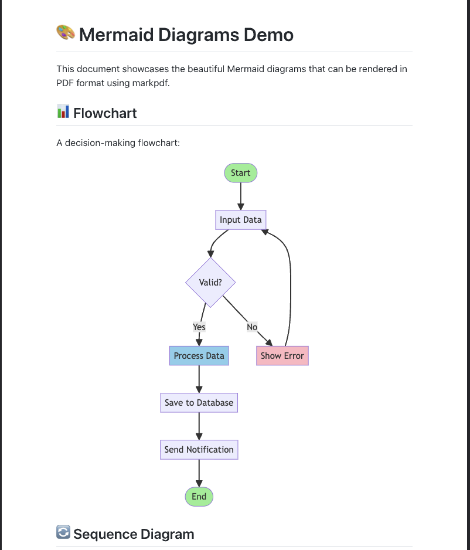
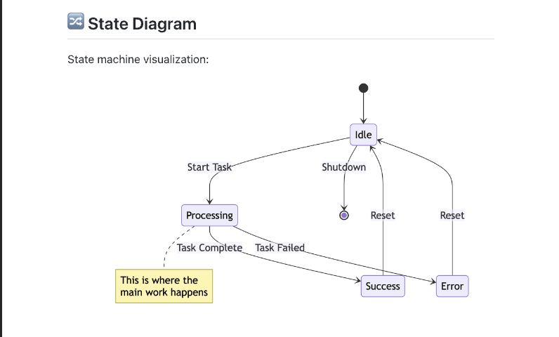
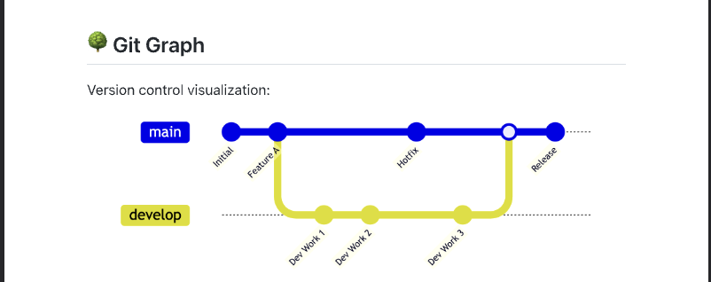
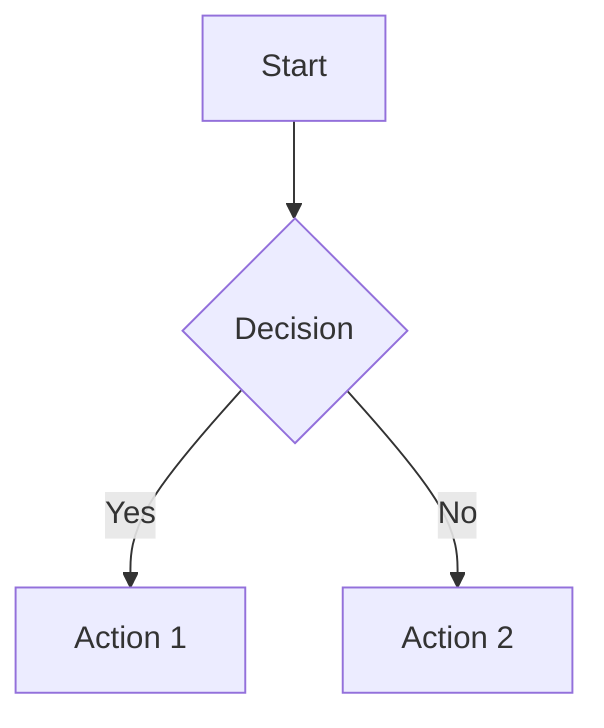

# 📄 Markdown to PDF Converter

<div align="center">

**A modern, powerful CLI tool for converting Markdown documents to beautiful PDFs**

**Source:** [github.com/ml-lubich/pdfify-md](https://github.com/ml-lubich/pdfify-md)

[](https://nodejs.org/)
[](https://www.typescriptlang.org/)
[](LICENSE)

</div>

## ✨ Features

- 🎨 **Mermaid Diagram Support** - Automatically renders flowcharts, sequence diagrams, Gantt charts, and more
- 🎯 **Syntax Highlighting** - Beautiful code blocks with syntax highlighting via highlight.js
- 🎨 **Custom Styling** - Full control over PDF appearance with custom CSS and stylesheets
- 📝 **Front Matter** - YAML configuration for document settings
- 🔄 **Watch Mode** - Automatically regenerate PDFs when files change
- 🚀 **Modern Architecture** - Clean, maintainable, and extensible TypeScript codebase
- 📦 **Programmatic API** - Use it as a library in your Node.js projects
- 🌐 **Multiple Formats** - Support for PDF and HTML output
- ⚡ **Concurrent Processing** - Convert multiple files simultaneously
- 🔧 **Highly Configurable** - Extensive customization options

## 🎨 Mermaid Diagram Showcase

<div align="center">

### Beautiful Diagrams Rendered in PDF

See the stunning Mermaid diagrams that can be rendered directly in your PDFs:

<table>
<tr>
<td align="center" width="33%">
<strong>Flowchart</strong><br>

</td>
<td align="center" width="33%">
<strong>State Diagram</strong><br>

</td>
<td align="center" width="33%">
<strong>Git Graph</strong><br>

</td>
</tr>
</table>

*All diagrams are automatically rendered from Markdown code blocks and embedded directly in your PDFs!*

</div>

## 📋 Table of Contents

- [Features](#-features)
- [Quick Start](#-quick-start)
- [Documentation](#-documentation)
- [Examples](#-examples)
- [Architecture](#-architecture)
- [Development](#-development)
- [Security](#-security-considerations)
- [Contributing](#-contributing)
- [License](#-license)

## 🚀 Quick Start

### Installation

```bash
npm install -g pdfify-md
```

Or clone and install locally:

```bash
git clone https://github.com/ml-lubich/pdfify-md.git
cd pdfify-md
npm install
npm link
```

#### As a Dependency

```bash
npm install pdfify-md
```

### Basic Usage

```bash
# Convert a single file
pdfify-md document.md

# Convert multiple files
pdfify-md *.md

# Watch mode - automatically regenerate on changes
pdfify-md --watch document.md

# Use stdin
cat document.md | pdfify-md > output.pdf
```

## 📖 Documentation

### Mermaid Diagrams

This tool has built-in support for Mermaid diagrams! Simply include Mermaid code blocks in your Markdown:

````markdown

````

**Supported diagram types:**
- Flowcharts
- Sequence Diagrams
- Gantt Charts
- Class Diagrams
- State Diagrams
- Entity Relationship Diagrams
- And more!


**Chart Configuration:**

Control chart sizes and resolution. **These parameters do NOT conflict** - they work together:

- `--mermaid-horizontal-width` - Max width for horizontal charts (default: 1600px)
- `--mermaid-vertical-width` - Max width for vertical charts (default: 250px)  
- `--mermaid-max-height` - Max height for vertical charts (default: 200px)
- `-r, --mermaid-resolution` - Image quality (default: 8, any positive number) - **does NOT change visual size, only PNG sharpness**

```bash
# One-time use (not persistent)
pdfify-md file.md --mermaid-horizontal-width 1000 -r 10

# Persistent: Use config file
pdfify-md file.md --config-file pdfify-md.config.json
```

**For persistent settings, use a config file** (see [Chart Configuration Guide](docs/CHART-CONFIGURATION.md)).

### Programmatic API

import { mdToPdf } from 'pdfify-md';
import { writeFileSync } from 'fs';

async function convert() {
  const pdf = await mdToPdf(
    { path: 'document.md' },
    {
      pdf_options: {
        format: 'A4',
        margin: '30mm',
        printBackground: true,
      },
    }
  );

  if (pdf) {
    writeFileSync(pdf.filename, pdf.content);
    console.log('PDF generated successfully!');
  }
}

convert();
```

### Configuration Options

pdfify-md supports multiple ways to configure PDF generation. Configuration sources are merged in the following order (later sources override earlier ones):

1. **Default configuration** - Built-in defaults
2. **Config file** (optional) - JSON/JS config file specified with `--config-file`
3. **Front matter** (optional) - YAML front matter in the Markdown file
4. **CLI arguments** - Command-line options (highest priority)

#### When to Use Each Method

- **Front Matter**: Use for document-specific settings that should be part of the document itself (recommended for per-document configuration)
- **CLI Arguments**: Use for temporary overrides, batch processing with different settings, or when you don't want to modify the document
- **Config File**: Use for project-wide defaults shared across multiple documents

#### CLI Options

| Option | Description | Example |
|-------|-------------|---------|
| `--basedir` | Base directory for file server | `--basedir ./docs` |
| `--stylesheet` | Custom stylesheet (can be used multiple times) | `--stylesheet custom.css` |
| `--css` | Inline CSS styles | `--css "body { font-size: 12px; }"` |
| `--highlight-style` | Code highlighting theme | `--highlight-style monokai` |
| `--pdf-options` | Puppeteer PDF options (JSON) | `--pdf-options '{"format":"Letter"}'` |
| `--watch` | Watch mode | `--watch` |
| `--as-html` | Output HTML instead of PDF | `--as-html` |
| `--port` | HTTP server port | `--port 3000` |

#### Front Matter Configuration

Configure your document using YAML front matter at the top of your Markdown file. This is the recommended approach for document-specific settings:

````markdown
---
pdf_options:
  format: a4
  margin: 30mm 25mm
  printBackground: true
  headerTemplate: |-
    <div style="text-align: center; font-size: 11px;">
      Document Title
    </div>
  footerTemplate: |-
    <div style="text-align: center;">
      Page <span class="pageNumber"></span> of <span class="totalPages"></span>
    </div>
stylesheet:
  - https://cdnjs.cloudflare.com/ajax/libs/github-markdown-css/5.0.0/github-markdown.min.css
body_class: markdown-body
highlight_style: github
---

# Your Document Content
````

**Note**: CLI arguments override front matter settings. For example, if your front matter specifies `format: a4` but you run `pdfify-md --pdf-options '{"format":"Letter"}' document.md`, the Letter format will be used.

### Advanced Features

#### Custom Headers and Footers

Use Puppeteer's header and footer templates with dynamic values:

```markdown
---
pdf_options:
  headerTemplate: |-
    <div style="font-size: 10px; width: 100%; text-align: center;">
      <span class="title"></span> - <span class="date"></span>
    </div>
  footerTemplate: |-
    <div style="font-size: 10px; width: 100%; text-align: center;">
      Page <span class="pageNumber"></span> of <span class="totalPages"></span>
    </div>
---
```

#### Page Breaks

Force page breaks using CSS:

```html
<div class="page-break"></div>
```

#### Math Formulas

Support for MathJax (see examples in `/src/test/mathjax`).

## 🏗️ Architecture

This tool uses a modern, modular architecture:

1. **Markdown Parser** - Uses Marked to convert Markdown to HTML
2. **Mermaid Processor** - Renders Mermaid diagrams to images using Puppeteer
3. **PDF Generator** - Uses Puppeteer (headless Chrome) to generate PDFs
4. **Styling Engine** - Applies custom CSS and themes

## 🛠️ Development

### Setup

```bash
git clone https://github.com/ml-lubich/pdfify-md.git
cd pdfify-md
npm install
```

### Build

```bash
npm run build
```

### Watch Mode (Development)

```bash
npm start
```

### Testing

```bash
npm test
```

### Linting

```bash
npm run lint
```

### Publishing to npm

If you get **403 (Two-factor authentication required)** you have two options:

- **Option A – Publish with a token (no code needed after setup):**
  1. Open **https://www.npmjs.com** and log in (use backup codes or account recovery if you lost your 2FA device).
  2. Go to **Access Tokens** (click your avatar → Access Tokens), then **Generate New Token**.
  3. Choose **Granular Access Token**. Name it e.g. `pdfify-md-publish`. Under **Packages** pick **Read and write** for the packages you publish. If you see **Bypass two-factor authentication**, turn it **on** so publish from the CLI doesn’t ask for a code.
  4. Generate the token and copy it (it’s shown only once).
  5. In your terminal, run once (paste your token instead of `YOUR_TOKEN`):
     ```bash
     npm config set //registry.npmjs.org/:_authToken YOUR_TOKEN
     ```
  6. After that you can run `npm publish` with no code.

- **Option B – Publish with a one-time code:** If you have your authenticator app, use the current 6-digit code: `npm publish --otp=YOUR_6_DIGITS`, or run `./scripts/npm-publish-with-otp.sh`.

To push to GitHub then publish: `./scripts/release-push-and-publish.sh`.

## 📝 Examples

### Quick Examples

#### Basic Conversion
```bash
pdfify-md README.md
```

#### Custom Styling
```bash
pdfify-md document.md \
  --stylesheet custom.css \
  --css "body { font-family: 'Georgia', serif; }" \
  --highlight-style github
```

#### Watch Mode
```bash
pdfify-md --watch document.md
```

#### Multiple Files
```bash
pdfify-md chapter1.md chapter2.md chapter3.md
```

#### Directory Processing
Pass a directory to process all Markdown files recursively:
```bash
pdfify-md ./docs
```

### Example Files

Check out the [`examples/`](./examples/) directory for complete example files:
- **[Mermaid Diagrams Demo](./examples/demo-mermaid.md)** - Comprehensive example with various Mermaid diagram types

More examples are available in [`src/test/`](./src/test/):
- Basic markdown examples (`src/test/basic/`)
- Mermaid diagram examples (`src/test/mermaid/`)
- Nested directory structures (`src/test/nested/`)
- Math formulas with MathJax (`src/test/mathjax/`)

## 🔒 Security Considerations

### Local File Server

This tool runs a local HTTP server to serve files during conversion. The server:
- Runs on `localhost` on a random port (or specified port)
- Shuts down automatically when the process exits
- Only serves files within the specified base directory

**Note:** Be cautious when running in watch mode, as the server remains active.

### Untrusted Content

Always sanitize user-provided Markdown content before processing to prevent security issues.

## 🤝 Contributing

Contributions are welcome! We appreciate your help in making pdfify-md better.

Please read our [Contributing Guide](CONTRIBUTING.md) for details on:

- Code of conduct
- Development setup
- Coding standards
- Testing requirements
- Pull request process

### Quick Contribution Steps

1. Fork the repository
2. Create your feature branch (`git checkout -b feature/amazing-feature`)
3. Make your changes and add tests
4. Ensure all tests pass (`npm test`)
5. Commit your changes (`git commit -m 'Add some amazing feature'`)
6. Push to the branch (`git push origin feature/amazing-feature`)
7. Open a Pull Request

## 📄 License

This project is licensed under a Non-Commercial License. All rights reserved.

**Copyright (c) 2024 Misha Lubich (ml-lubich)**

This software is provided for **educational and non-commercial use only**. 

### Key Terms:
- ✅ **Educational Use** - Free to use for teaching, learning, and research
- ✅ **Personal Projects** - Free to use for personal, non-commercial projects
- ✅ **Open Source** - Free to use in open source projects (non-commercial)
- ❌ **Commercial Use** - Requires explicit written permission from the author
- ✅ **Attribution Required** - All uses must credit Misha Lubich (ml-lubich) as the original author

**For commercial licensing inquiries**, please contact: michaelle.lubich@gmail.com

See the [LICENSE](LICENSE) file for full license terms.

## 👤 Author

**Misha Lubich**

- GitHub: [@ml-lubich](https://github.com/ml-lubich)
- Email: michaelle.lubich@gmail.com

## 🙏 Acknowledgments

- Built with [Marked](https://github.com/markedjs/marked) for Markdown parsing
- Powered by [Puppeteer](https://github.com/puppeteer/puppeteer) for PDF generation
- Syntax highlighting by [highlight.js](https://github.com/highlightjs/highlight.js)
- Diagram rendering with [Mermaid](https://mermaid.js.org/)

---

<div align="center">

Made with ❤️ by [Misha Lubich](https://github.com/ml-lubich)

</div>
