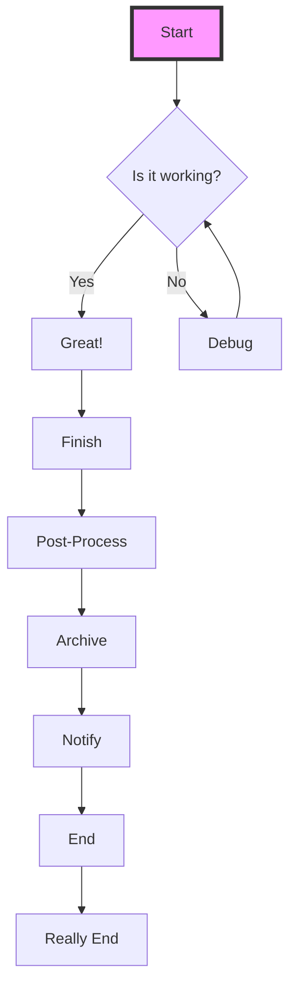

# Stress Test Document

This document tests the limits of PDF generation.

## 1. Wide Tables
This table has many columns to test the CSS cutoff fix.

| ID | Name | Email | Role | Department | Location | Status | Last Login | Permissions | Notes | Extra Column 1 | Extra Column 2 | Extra Column 3 |
|----|------|-------|------|------------|----------|--------|------------|-------------|-------|----------------|----------------|----------------|
| 1 | John Doe | john.doe@example.com | Admin | Engineering | New York | Active | 2023-01-01 | Read, Write, Delete, Execute, Admin | Some notes here | Data 1 | Data 2 | Data 3 |
| 2 | Jane Smith | jane.smith@example.com | User | Marketing | London | Inactive | 2023-02-15 | Read, Write | More notes here to make it long | Data 1 | Data 2 | Data 3 |

## 2. Long Content without Spaces
This tests word breaking.
`SuperLongVariableNameThatShouldNotBreakIdeallyButIfItDoesItShouldWrap`

## 3. Large Mermaid Diagram


## 4. Syntax Highlighting
```typescript
import { join } from 'path';

export const getPath = (file: string): string => {
    return join(__dirname, file);
}
```
