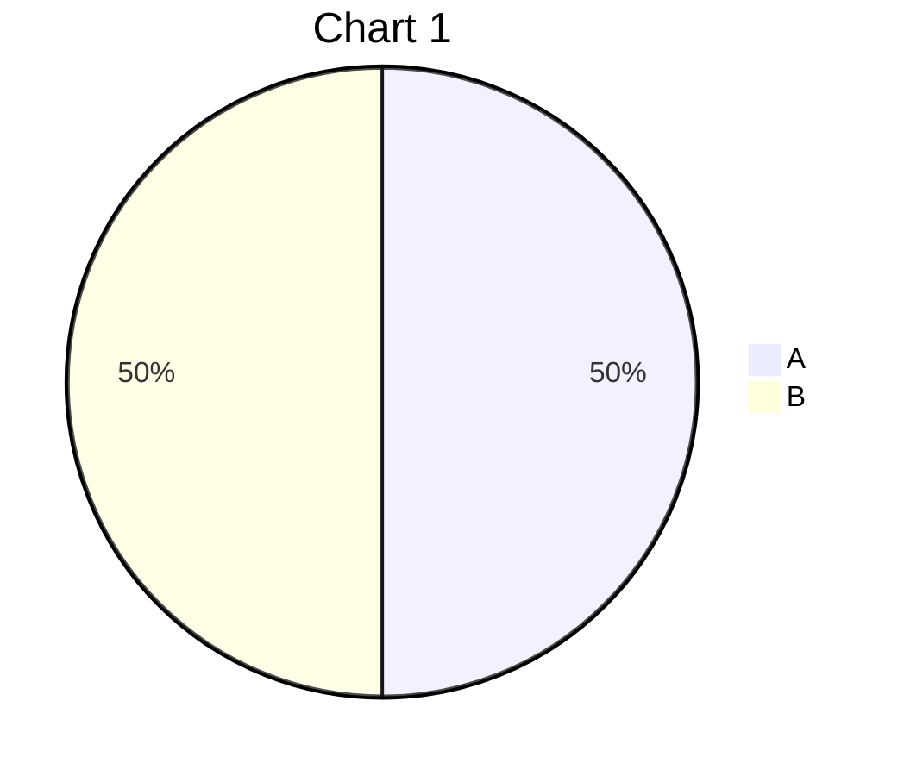
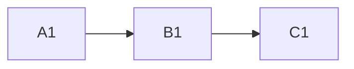
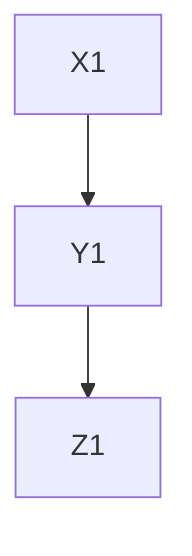
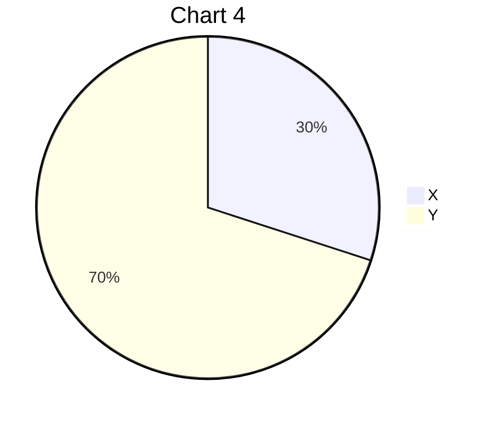
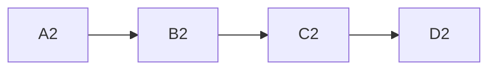
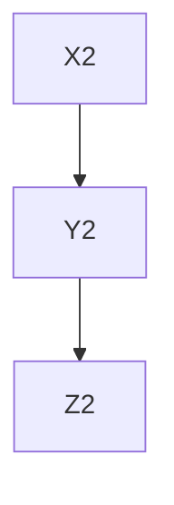
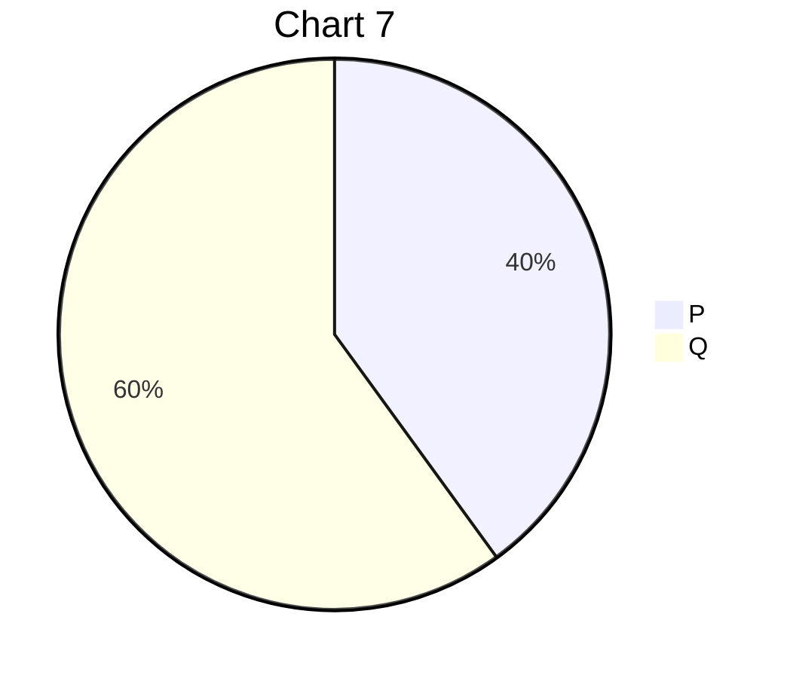
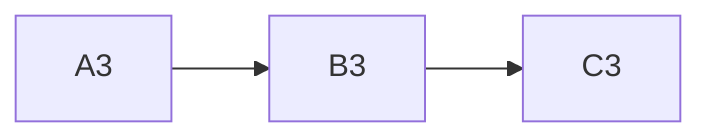

# Many Charts Test

```mermaid
pie title Chart 1
    "A" : 50
    "B" : 50
```

```mermaid
flowchart LR
    A1 --> B1 --> C1
```

```mermaid
flowchart TD
    X1 --> Y1 --> Z1
```

```mermaid
pie title Chart 4
    "X" : 30
    "Y" : 70
```

```mermaid
flowchart LR
    A2 --> B2 --> C2 --> D2
```

```mermaid
flowchart TD
    X2 --> Y2 --> Z2
```

```mermaid
pie title Chart 7
    "P" : 40
    "Q" : 60
```

```mermaid
flowchart LR
    A3 --> B3 --> C3
```

## End

