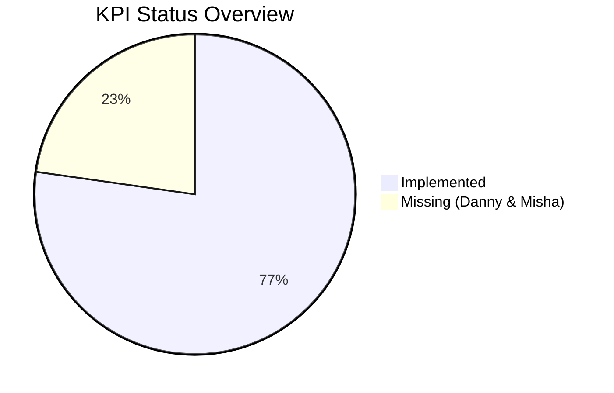
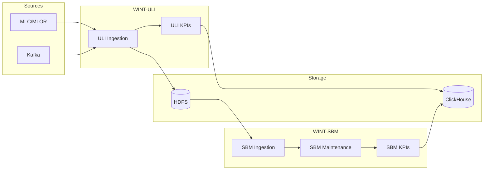
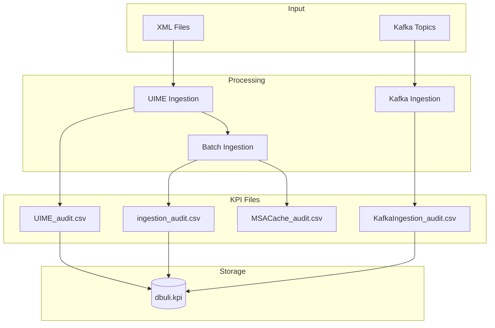

# Test Mermaid Charts

## Pie Chart

```mermaid
pie title KPI Status Overview
    "Implemented" : 112
    "Missing (Danny & Misha)" : 33
```

## Flowchart LR

```mermaid
flowchart LR
    subgraph Sources
        MLC[MLC/MLOR]
        Kafka[Kafka]
    end
    
    subgraph WINT-ULI
        ULI_Ingest[ULI Ingestion]
        ULI_KPI[ULI KPIs]
    end
    
    subgraph WINT-SBM
        SBM_Ingest[SBM Ingestion]
        SBM_Maint[SBM Maintenance]
        SBM_KPI[SBM KPIs]
    end
    
    subgraph Storage
        HDFS[(HDFS)]
        CH[(ClickHouse)]
    end
    
    MLC --> ULI_Ingest
    Kafka --> ULI_Ingest
    ULI_Ingest --> HDFS
    ULI_Ingest --> ULI_KPI
    HDFS --> SBM_Ingest
    SBM_Ingest --> SBM_Maint
    SBM_Maint --> SBM_KPI
    ULI_KPI --> CH
    SBM_KPI --> CH
```

## Flowchart TD

```mermaid
flowchart TD
    subgraph Input
        Files[XML Files]
        Kafka[Kafka Topics]
    end
    
    subgraph Processing
        UIME[UIME Ingestion]
        Batch[Batch Ingestion]
        KafkaIng[Kafka Ingestion]
    end
    
    subgraph KPI_Files[KPI Files]
        UIME_CSV[UIME_audit.csv]
        Ing_CSV[ingestion_audit.csv]
        Kafka_CSV[KafkaIngestion_audit.csv]
        MSA_CSV[MSACache_audit.csv]
    end
    
    subgraph Storage
        CH[(dbuli.kpi)]
    end
    
    Files --> UIME
    Kafka --> KafkaIng
    UIME --> UIME_CSV
    UIME --> Batch
    Batch --> Ing_CSV
    KafkaIng --> Kafka_CSV
    Batch --> MSA_CSV
    UIME_CSV --> CH
    Ing_CSV --> CH
    Kafka_CSV --> CH
```

